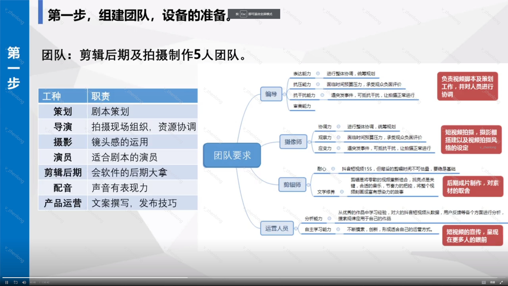
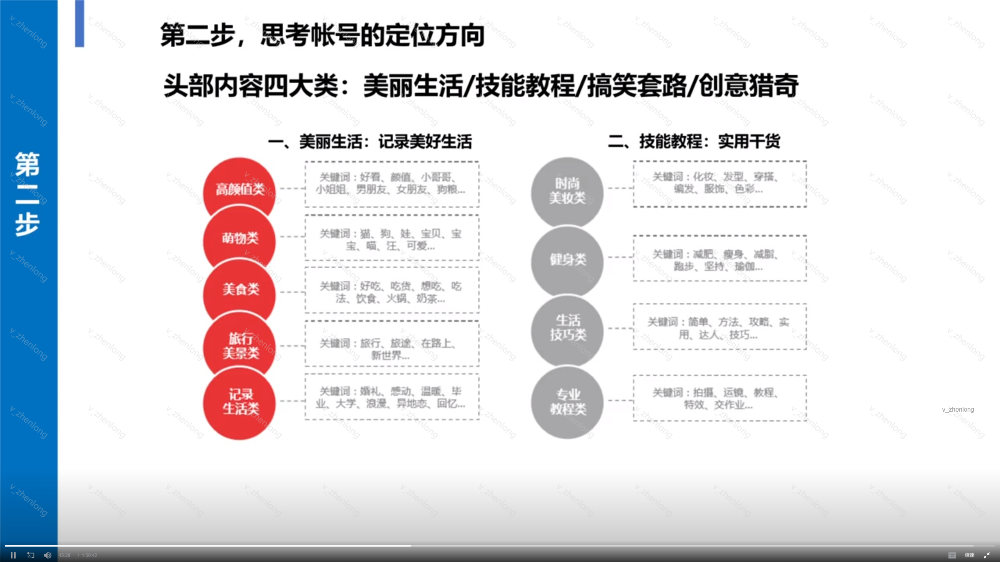
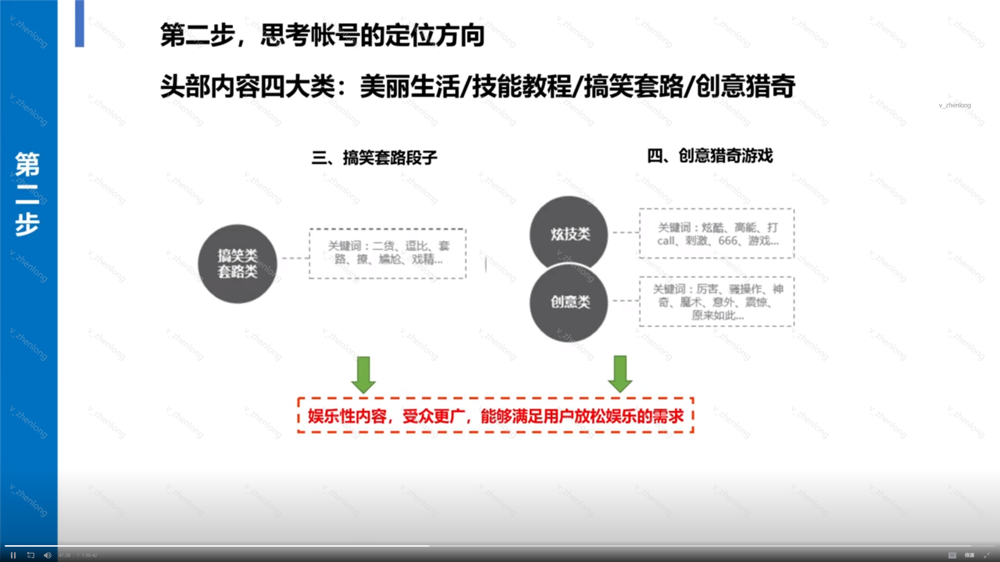
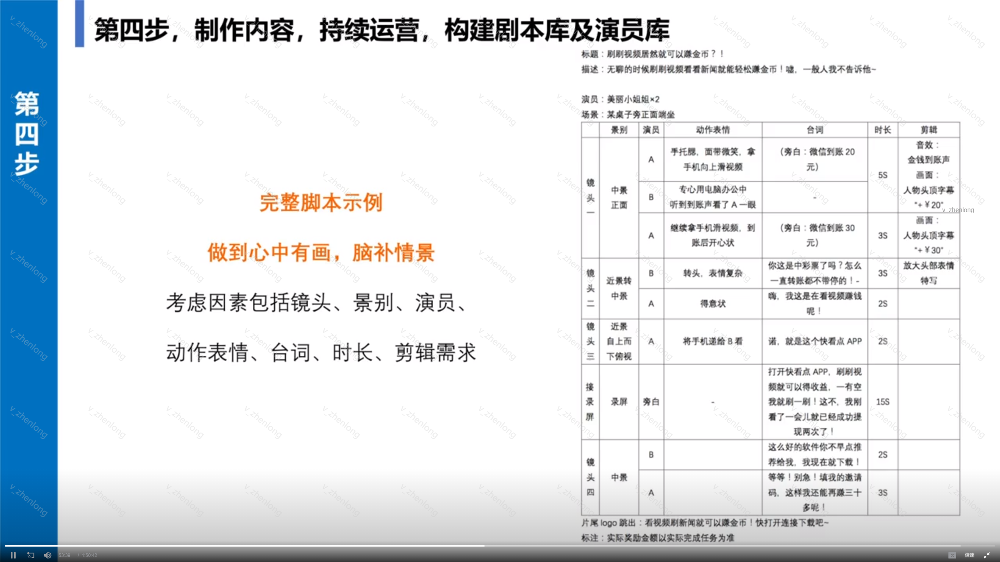
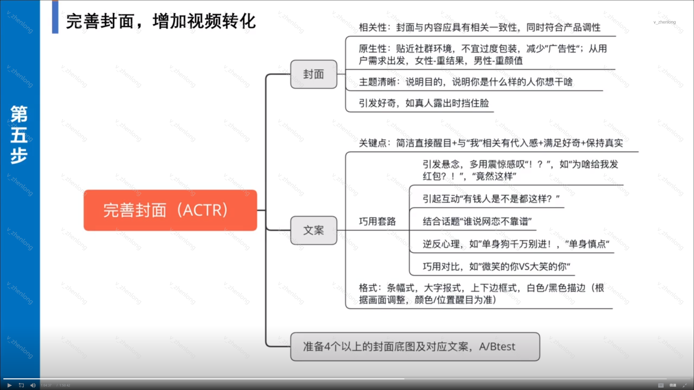
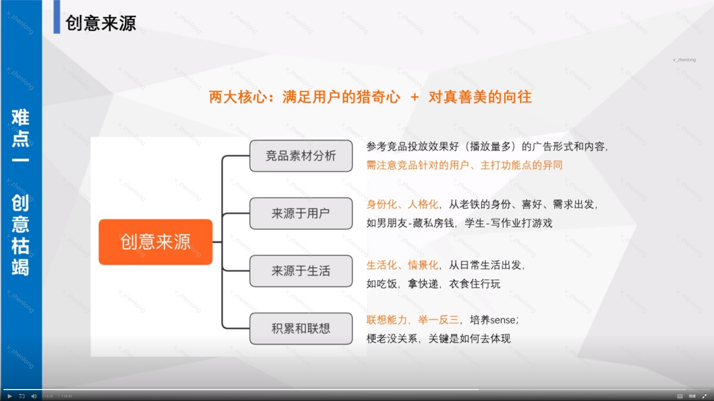
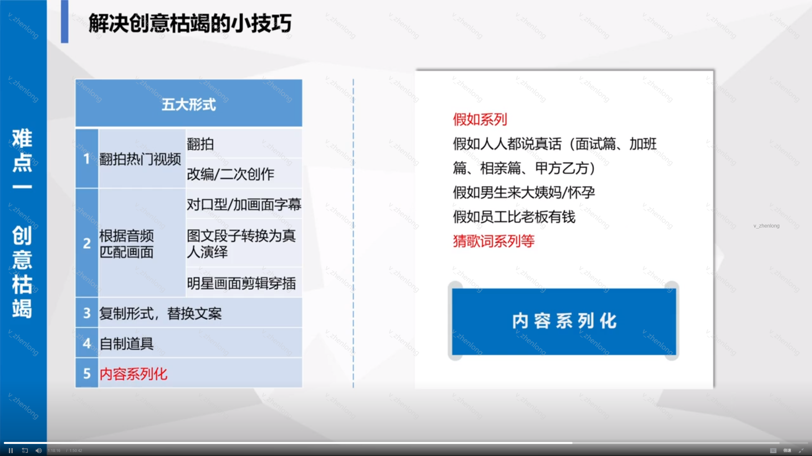
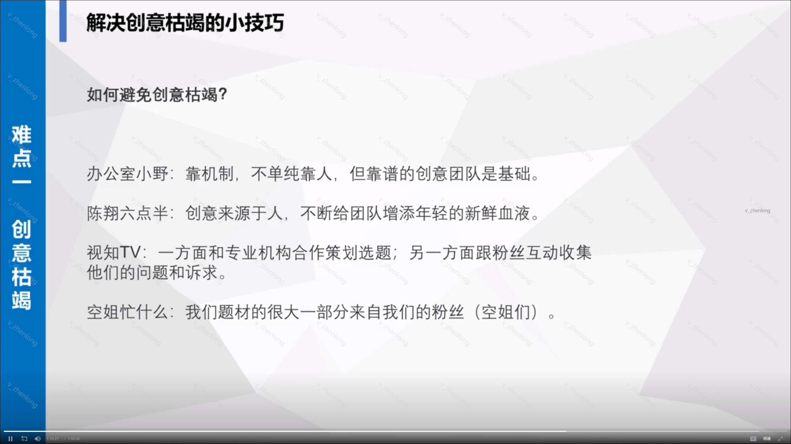
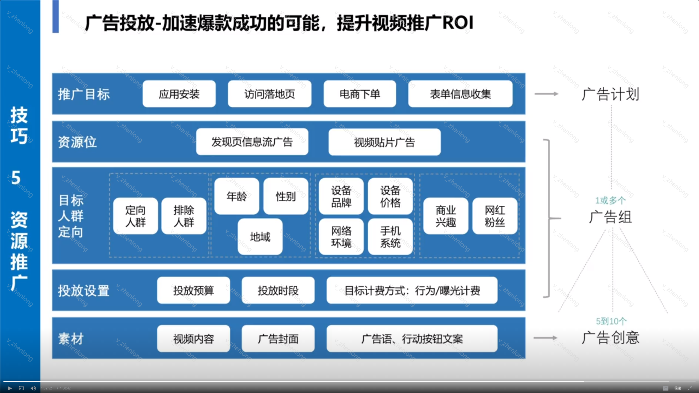

### 短视频比较:快手/抖音
#### 抖音
1. 城市化、年轻化、生活题材内容受欢迎、年轻潮人有一技之长
2. 精致生活
3. 推广语：记录美好生活（强调优质性）
4. 分发机制：算法流量分发，中心化运营。基于内容质量，粉丝量和用户兴趣进行分发。以头部大V为中心，把认为最后的内容推给用户（eg:百度+微博）
5. 依靠优质内容带来的流量。粉丝获取效率、爆款率高（先发制人但后劲不足）
6. 商业化：强直播变现；信息流：贴广告和发现页视频广告
7. 内容生态：UGC为主，草根属性强
8. 用户构成：核心：多元大众；城市：三四线居多；性别比例：男女均衡；身份特征：用户下沉、低龄、低学历、商业信息接受度高、内容搞笑、猎奇
9. 深度参与，爱点赞发评论
#### 快手
1. 趣味、搞怪乡村
2. 平民化路线，真实
3. 记录世界记录你（强调原生性）
4. 社交兴趣分发，去中心化弱运营。基于用户社交关注和兴趣调控流量分发。由用户自己创造内容、自由选择想看的内容。（eg：朋友圈）
5. 流量属性：基于信任关系的订阅关注，沉淀粉丝私域流量，转化率高（厚积薄发）
6. 商业化：强广告变现。蓝V、星图、信息流
7. PGC为主，专业性强（mcn机构）
8. 用户构成：核心：KOL和流量明星；城市：一二线；性别比例：女性多；身份特征：年轻用户，商业信息接受度低、好玩、音乐
9. 用户行为：点赞之交，爱点赞看评论

### 短视频运营

#### 第一步，团队and设备

#### 第二步，思考账号的定位方向

#### 第三步、思考账号定位，为账号赋予人设
例子：宠物：傻，可爱

#### 第四步、制作内容，持续运营，构建剧本库及演员库

##### 剪辑软件
1. Pr
2. MediaEncoder
3. 快剪辑、巧影（Android上好用的软件）
4. videoleap（iPhone）
5. photoshop（加简单特效）
6. after effects cc（高级特效）

##### 内容审核
1. 神鬼不过
2. 政治不过

#### 第五步、装饰主页，引导用户“路转粉”
1. 完善封面，增加视频转化

2. 分析用户偏好（女性重结果，感性思维；男性重颜值，猎奇）
3. 巧用对比
4. 引起互动
5. 逆反心理
6. 突出表现点

#### 第六步、发布时间-不同平台差异化运营发布时间

#### 第七步，追踪粉丝量增长情况，各视频播放情况
#### 创意枯竭怎么办？

#### 怎么制作爆款内容？
完播率、互动率（点赞、评论、转发）越高，获得更多流量。
1. 控制视频时长
2. 争议内容引导评论，制作神评论（准备神评论，对评论点赞）
3. 加字幕，有些用户静音看
4. 吐槽穿帮镜头
5. 文案引导点赞
6. 结合热门话题，制作内容

##### 深入挖掘热点信息
微博热搜、百度指数、微信指数、水滴APP
##### 如何蹭热点
1. 搬运合集
2. 分析，理清关系
3. 表达观点引起共鸣

##### 选定内容对应人群，洞察用户心理
#### 粉丝粘度怎么维持？
互动、互动、互动

### 还是不能随便蹭热点，聚焦内容，聚焦目标用户

